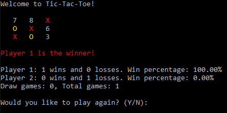

This is a simple game built as an assignment for our introductory C++ class at ACC. 

Details:

Class: Board

Methods:

* drawBoard()
* getMove()
* getWinner()
* setWinner()
* switchPlayer()
* checkWinner()

